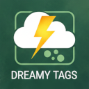

# Dreamy Tag Cloud

The Dreamy Tag Cloud plug-in will allow you to display a tag cloud that filters based on category and tags. You can use Short Code or Gutenberg Code Blocks.

# Short Code

`[dreamy_tag_cloud cat="786439348" tags="786439775" exclude="786439762,786439759" title="Dreamy Tags" auto_exclude="true"]`

* cat (optional, comma-delimited) - the category id's that posts must have at least one
* tags (optional, comma-delimited) - the tag id's that a post must have at least one
* exclude (optional, comma-delimited) - tag id's that should be excluded from the cloud
* auto_exclude (optional, boolean [true]) - indicates filtered tags should be excluded from the cloud
* title (optional, string) - title to display above tag cloud

# Gutenberg Code Blocks

The code block settings map to the short code.

* Title (see title)
* Filter Categories (see cat)
* Filter Tags (see tags)
* Exclude Tags (see exclude)
* auto-exclude filtered tags (see auto_exclude)

## Build
1. Open Terminal.
2. Navigate to your project folder (type `cd` and drag the folder in).
3. Run this command to make the script executable: `chmod +x build.sh`
4. Execute the script `./build.sh`
5. Upload the `dreamy-tag-cloud-v#.#.#.zip` to your wordpress plugin dashboard.